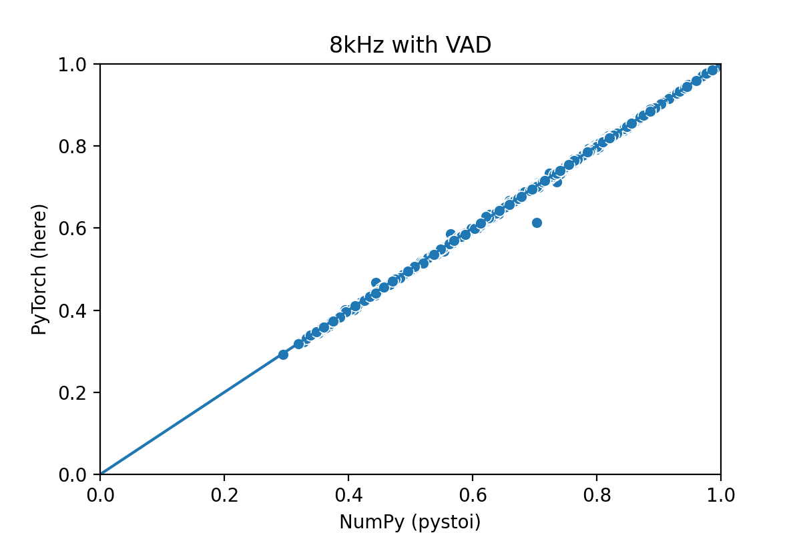
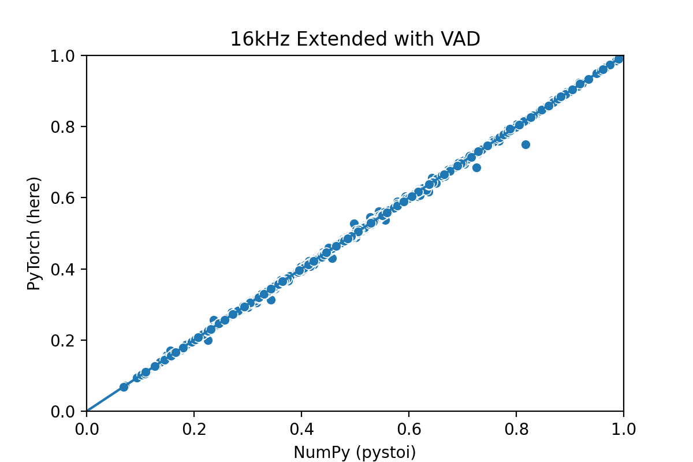

## PyTorch implementation of STOI
[![Build Status][travis-badge]][travis]
[](https://badge.fury.io/py/torch-stoi)


Implementation of the classical and extended Short 
Term Objective Intelligibility in PyTorch.
See also [Cees Taal's website](http://www.ceestaal.nl/code/) and 
the [python implementation](https://github.com/mpariente/pystoi)

### Install
```bash
pip install torch_stoi
```

## Important warning
**This implementation is intended to be used as a loss function only.**  
It doesn't replicate the exact behavior of the original metrics
but the results should be close enough that it can be used 
as a loss function. See the Notes in the
 [`NegSTOILoss`](./torch_stoi/stoi.py) class.
 
Quantitative comparison coming soon hopefully :rocket:

### Usage
```python
import torch
from torch import nn
from torch_stoi import NegSTOILoss

sample_rate = 16000
loss_func = NegSTOILoss(sample_rate=sample_rate)
# Your nnet and optimizer definition here
nnet = nn.Module()

noisy_speech = torch.randn(2, 16000)
clean_speech = torch.randn(2, 16000)
# Estimate clean speech
est_speech = nnet(noisy_speech)
# Compute loss and backward (then step etc...)
loss_batch = loss_func(est_speech, clean_speech)
loss_batch.mean().backward()
```

### Comparing NumPy and PyTorch versions : the static test
Values obtained with the NumPy version (commit [84b1bd8](https://github.com/mpariente/pystoi/commit/84b1bd8f894c76eb5ddc3425946a4e2052e825fe)) are compared to
the PyTorch version in the following graphs.  
##### 8kHz
Classic STOI measure

 

Extended STOI measure

 

##### 16kHz
Classic STOI measure

 

Extended STOI measure

 


16kHz signals used to compare both versions contained a lot
of silence, which explains why the match is very bad without 
VAD. 

### Comparing NumPy and PyTorch versions : Training a DNN
Coming in the near future

### References
* [1] C.H.Taal, R.C.Hendriks, R.Heusdens, J.Jensen 'A Short-Time
  Objective Intelligibility Measure for Time-Frequency Weighted Noisy Speech',
  ICASSP 2010, Texas, Dallas.
* [2] C.H.Taal, R.C.Hendriks, R.Heusdens, J.Jensen 'An Algorithm for
  Intelligibility Prediction of Time-Frequency Weighted Noisy Speech',
  IEEE Transactions on Audio, Speech, and Language Processing, 2011.
* [3] J. Jensen and C. H. Taal, 'An Algorithm for Predicting the
  Intelligibility of Speech Masked by Modulated Noise Maskers',
  IEEE Transactions on Audio, Speech and Language Processing, 2016.


[travis]: https://travis-ci.com/mpariente/pytorch_stoi
[travis-badge]: https://travis-ci.com/mpariente/pytorch_stoi.svg?branch=master
